# Working through the first module, Bandit, on Over-the-Wire

**#Level 0**\
**#Connect to bandit.labs.overthewire.org on port 2220 using ssh, with username = bandit0 and password = bandit0.**

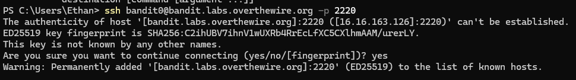

**#Level 1**\
**#Retrieve password from readme file and use to ssh into bandit1**

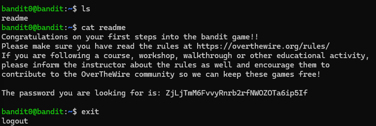

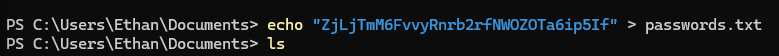

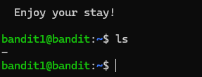

**#Level 2**\
**#Retrieve the password from the - file, which is the password for bandit2. The trick here is knowing how to open a file that begins with -.**

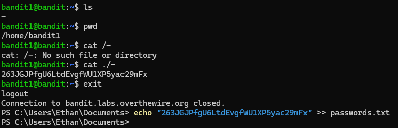

**#Level 3**\
**Retrieve password from "spaces in file name" which is stored on bandit2**

**#Level 4**\
**Retrieve password from the hidden file stored in the inhere directory. Using the -a option on the ls command will reveal hidden files.**

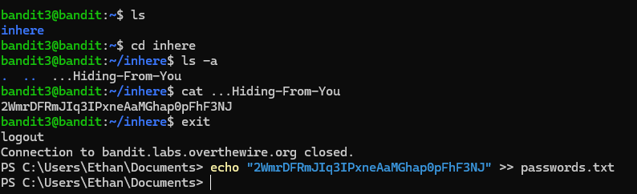

**Level 5**\
**Retrieve password from the only human-readable file in the directory. The challenge here is determining the correct file. We can use the file command to print out file types for us**

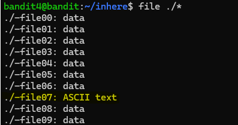
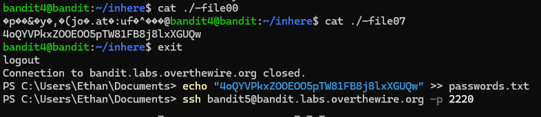

**Level 6**\
**Retrieve password from the only human-readable, non executable, and 1033 bytes in size**

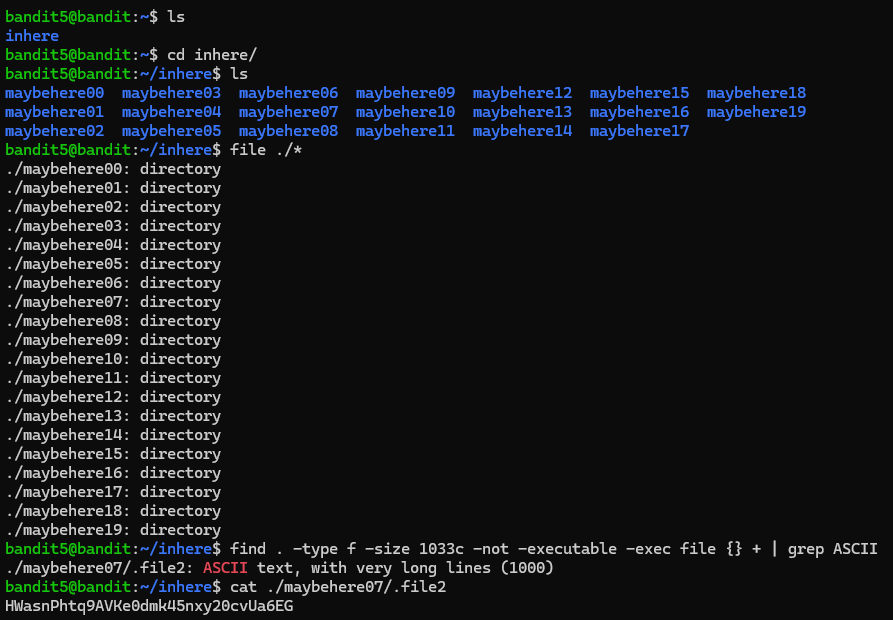

**Level 7**\
**Retrieve password stored somewhere on the server that is owned by user bandit7, owned by group bandit6, and 33 bytes in size.**

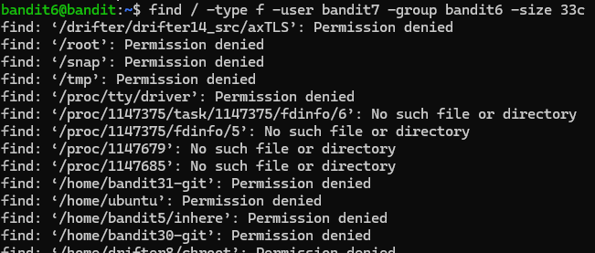

**use 2> /dev/null to filter out errors**
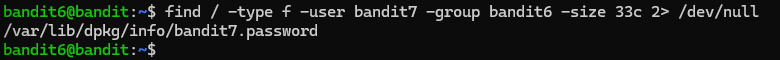

**Level 8**\
**Retrieve password from the data.txt file where the password is next to the word millionth. We will use the grep command to find it.**

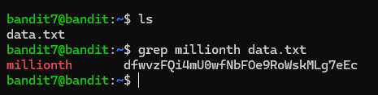

**Level 9**\
**Retrieve the only unique password from the data.txt file. This requires the use of the sort and uniq command**

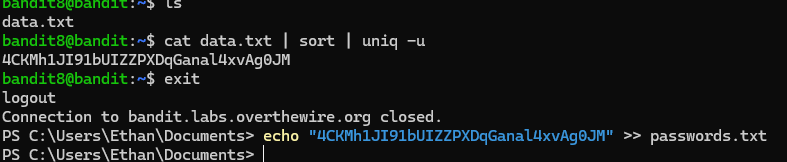

**Level 10**\
**Retrieve password from the data.txt file that is one of the few human-readable strings, preceded by several '=' characters.**

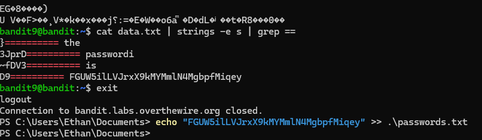