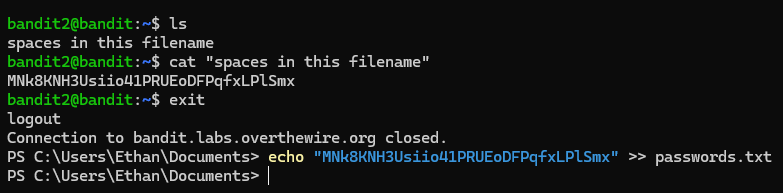

# Working through the first module, Bandit, on Over-the-Wire

**#Level 0**\
**#Connect to bandit.labs.overthewire.org on port 2220 using ssh, with username = bandit0 and password = bandit0.**

**#Level 1**\
**#Retrieve password from readme file and use to ssh into bandit1**

**#Level 2**\
**#Retrieve the password from the - file, which is the password for bandit2. The trick here is knowing how to open a file that begins with -**

**#Level 3**\
**Retrieve password from "spaces in file name" which is stored on bandit2**

